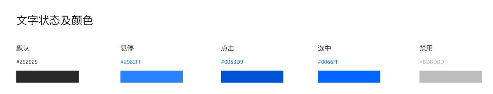

# UI设计规范

## 品牌色

### 蓝色

正常：

0066FF

悬浮：

2982FF

点击：

0053D9

禁用：

7AB4FF

默认背景：

E6F1FF

### 橙色

正常：

FF8125

悬浮：

FF9E4F

点击：

D96016

禁用：

FFD1A1

默认背景：

FFF7EB

### 红色

正常：
E5403C

悬浮：

F26D66

点击：
BF282B

禁用：

FFC4BD

背景：

FFEFEB

### 绿色

正常：
1DCC34

悬浮：

45BF51

点击：

158C29

禁用：

93D996

背景：

E6F7E6

## 文字状态及颜色

## Alert警示色

正常：

0066FF

成功：

24B237

故障：

E5403C

警示：

FF8125

离线：

858585

## 按钮

标准尺寸：
100*32

小尺寸：

70*32

大尺寸：

120*40

关闭按钮：

## 对话框

